# How a change becomes a release

The bot is developed by an AI agent — Claude Code, driven by the skills in
[`.claude/skills/`](.claude/skills/). This drawing is the map, not the
authority: each stage's rules live in the skill it names, and on any
disagreement the skill wins, then the drawing is fixed. The retrospective
stage keeps it honest — a lesson that changes a default redraws the step it
touches, in the same commit. The colours are pinned on purpose: every message
sits on a light stage band, so the forced dark text stays readable in both of
GitHub's themes.

```mermaid
%%{init: {"theme": "base", "themeVariables": {
  "textColor": "#111111",
  "signalTextColor": "#111111",
  "signalColor": "#334155",
  "actorTextColor": "#111111",
  "actorBkg": "#e0f2fe",
  "actorBorder": "#0369a1",
  "actorLineColor": "#94a3b8",
  "noteTextColor": "#111111",
  "noteBkgColor": "#fef3c7",
  "noteBorderColor": "#b45309",
  "labelTextColor": "#111111",
  "loopTextColor": "#111111",
  "labelBoxBkgColor": "#f1f5f9",
  "labelBoxBorderColor": "#334155",
  "sequenceNumberColor": "#ffffff"
}}}%%
sequenceDiagram
    autonumber
    actor U as Product owner
    participant C as Claude Code, the AI developer
    participant D as Claude Design, the design system
    participant K as Project skills, .claude/skills
    participant S as Sonnet subagents
    participant H as Auto-linter, fires on its own
    participant R as Second AI agent, the reviewer
    participant G as GitHub, repository and CI
    participant V as Production server

    rect rgb(254, 249, 231)
    note over U,K: Stage 1. Framing the task and the mockup
    U->>C: the feature, in the owner's own words
    C->>C: study the project: CLAUDE.md is already in context, its links lead to PLAN.md and TECH-DEBT.md
    C->>C: check the tech debt: a task that trips a deferred item's trigger takes it into scope
    opt the description leaves questions
        C->>U: every question at once, before any work
        U-->>C: answers
    end
    C->>U: the size of the phase in one line, tripped debt included
    U-->>C: agreed, or cut it down
    opt the feature shows the user something
        C->>D: build a mockup on the existing design system
        D-->>C: the rendered mockup
        C->>U: mockup for approval
        U-->>C: approved, or changes
    end
    C->>K: the add-a-feature skill
    K-->>C: how a feature is shaped: the layers, where files go, how they are named
    C->>K: the write-a-spec skill
    K-->>C: how to test: one spec per file, everything around it stubbed
    opt the feature needs new database queries
        C->>K: the add-repository-method skill
        K-->>C: five files that only change together
    end
    C->>C: now, knowing the rules, freeze the interfaces: what each function takes and returns
    end

    rect rgb(245, 245, 245)
    note over C,H: Stage 2. Writing the code and the tests
    C->>C: cut the work into pieces: what runs in parallel, what I keep — the shared shape, the copy, the risky core
    C->>S: briefs to every subagent in one go, each with its own piece and its own skill
    par in parallel
        loop one file at a time
            C->>C: write the core of the feature
            note right of H: saving a file fires this check by itself
            H--)C: style findings for exactly that file
            opt findings exist
                C->>C: fix now, before the next file
            end
            C->>C: write the unit tests: everything around the file replaced with stubs
        end
    and
        S->>S: each writes its piece strictly to the brief
        S-->>C: finished files, proven by their own tests
        C->>C: accept the result, weld the seams between the pieces
    end
    end

    rect rgb(240, 253, 244)
    note over C,H: Stage 3. Quality gates
    opt the task changed what the bot or the site draws
        C->>K: the refresh-the-pictures skill
        K-->>C: the table of every committed picture, what draws it, and which have no gate but the table
        C->>C: regenerate the stale ones and open every PNG — mockups, posters, previews, icons
    end
    C->>K: the finish-phase skill
    K-->>C: the order of the gates and their thresholds
    loop while any gate is red — fix, then re-run only the one that fell
        C->>C: npm run check:phase — one command, every gate in a row, the tests run once
        C->>C: lint and types, documents checked against the code, the suite under coverage with a 70% floor
        C->>C: Stryker mutates the diff — the tests must notice, 85% threshold
        C->>C: e2e over the diff — the real bot against a fake Telegram
    end
    C->>C: the poster gallery: open every picture myself, look for overflowing text and broken lines
    C->>C: walk everything outside src/ — deploy scripts, systemd units, CI config: no automatic gate sees them
    end

    rect rgb(240, 249, 255)
    note over C,R: Stage 4. Review by a second AI agent
    C->>R: the phase's whole diff in one piece
    R-->>C: findings, most severe first
    loop for each finding
        alt worth fixing now
            C->>C: fix the code and re-run only the affected gate
        else not worth fixing now
            C->>C: record it in TECH-DEBT.md with the trigger that would make it worth doing
        end
    end
    end

    rect rgb(253, 242, 248)
    note over C,K: Stage 5. Retrospective — fixing the process and the documents
    C->>C: count in numbers: what was rebuilt, what ran for nothing
    C->>K: land a new rule in the skills, so the mistake cannot repeat
    C->>C: a lesson that changed the flow itself redraws this very diagram
    C->>C: save the takeaway to persistent memory — it outlives this session
    C->>K: the write-a-doc skill
    K-->>C: every fact has one home document, and CLAUDE.md has a line budget
    C->>C: update README, PLAN and whatever else the phase owes
    opt the design moved mid-phase, or the pictures were redrawn
        C->>K: the update-the-design-page skill
        K-->>C: pull the page, splice the real drawings in, bump the revision
        C->>D: the implemented reality, pushed back to the design page
    end
    C->>C: npm run docs:check — links resolve, nothing is duplicated, the budget holds
    end

    rect rgb(237, 233, 254)
    note over C,V: Stage 6. Release to production
    C->>K: the write-a-commit skill
    K-->>C: the title says what the bot does differently, the body says why the old shape was wrong, plus the Gates paragraph
    C->>G: commit and push to main
    G->>G: CI on push — npm run check:push: lint, types, documents — the site ships straight from main, tests wait for the tag
    alt push check red
        G-->>C: the failure report
        C->>C: fix and push again
    else green
        G-->>U: a green check on the commit
        U->>U: npm version with the release message
        U->>U: the pre-push hook runs npm run check:release — a red tag cannot leave the machine
        U->>G: the tag is pushed
        G->>G: CI repeats the full battery on a clean clone — the second opinion
        note right of V: the server does not wait for CI — the local hook is the gate
        V->>G: asks every five minutes whether a new tag appeared
        G-->>V: the newest release tag
        V->>V: installs it: npm ci and a service restart
        V-->>U: the bot is updated, and a failed install rolls back on its own
    end
    end
```

