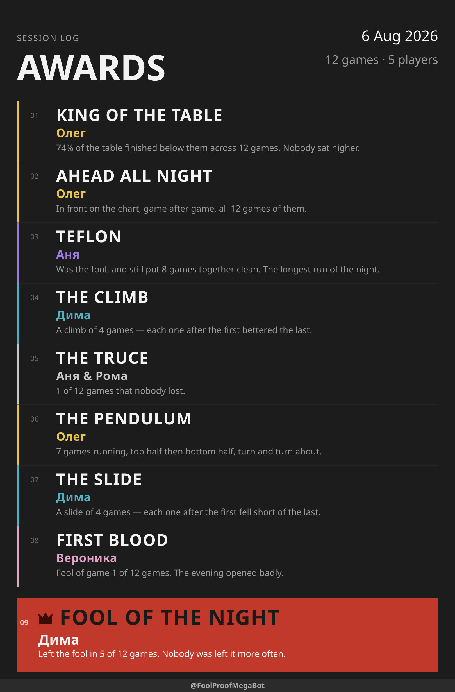

# FoolProof

A Telegram bot that keeps the score for a group of friends playing Podkidnoy
Durak. It records who went first, the order players went out, and who was left
the fool, then reports how the evening went.

Input happens on a Friday night, on a phone, one-handed, between games. So the
whole product is one message with an inline keyboard: you tap the names in the
order people finish, and tap Confirm. There is nothing to type after the line-up.

```
Game 3
Went first: Oleg

┌──────────────┬──────────────┐
│  ✅ 1 Oleg   │  ✅ 2 Roma   │
├──────────────┼──────────────┤
│     Anya     │     Dima     │
├──────────────┴──────────────┤
│  🤝 Draw     │  ↩️ Back      │
└──────────────┴──────────────┘
```

## Commands

| Command | What it does |
|---|---|
| `/game Oleg, Anya, Roma` | Opens a card. The list is the seating order, clockwise |
| `/game` | Same, but asks for the names — for when you tapped the command from the menu |
| `/next` | A new card with the same line-up; the fool's neighbour goes first |
| `/next_with Zhenya` | The same line-up plus these players; asks for the names if sent without any, then asks where everyone sits |
| `/next_without Oleg` | The same line-up minus these players; asks the same way |
| `/stats` | How the current session is going: the chronology, then the awards |
| `/stats_chronology` | The chronology picture on its own |
| `/stats_awards` | The awards picture on its own; needs five games |
| `/personal` | One player's card for all time — pick a name, get the poster |
| `/merge` | Folds a name typed twice into the right one |
| `/language` | Picks the language this chat is played in — English or Russian |
| `/start` | What the bot is, and a button that puts it in a group |
| `/help` | What the commands do and how the card works |

This table is the one place the commands are listed; `PLAN.md` says what each one
has to do.

### When one player ends up under two names

Somebody types `Анна` once and `Аня` the rest of the evening, and `/stats` grows a
sixth player who played one game. `/merge` shows every name with the games behind
it, and the **first name you tap is the one that stays**:

```
Merging names
Анна → Аня
Аня will have 13 games.

┌──────────────────────────────┐
│        ⭐ Аня · 12           │
├──────────────────────────────┤
│        ➕ Анна · 1           │
├──────────────────────────────┤
│           Oleg · 12          │
├──────────────┬───────────────┤
│  ↩️ Back      │  ✅ Confirm   │
└──────────────┴───────────────┘
```

There is no undo, which is what the Confirm button is for. Two merges are refused
with the reason, and [PLAN.md](PLAN.md#merging-two-names-into-one) says why.

### The pictures it sends back

`/stats` answers with two PNGs: the chronology of the evening, then the awards.
Both are below at the size a phone gets them, and both were drawn by the bot's own
renderer over a sample evening rather than by hand — `node scripts/tools.ts mockups`
redraws them whenever the drawing code changes.

| The chronology — a row per game, a column per player | The awards — at most nine, and the fool last |
|---|---|
| [](docs/mockups/chronology.png) | [](docs/mockups/awards.png) |

`/personal` answers with a third: one player's card for everything they have ever
played here. Pick a name from the keyboard it offers and it draws the numbers, the
share of the table evening by evening, what stuck, and who has been the worst news.

| The player card — six numbers, a career chart, three facts and a rival |
|---|
| [](docs/mockups/personal.png) |

The grid prints the finishing position in every cell, and marks only what an
ordinary finish is not: drew for last, left the fool, did not play. Under it, each
player's running share of the table — 50% is mid-table, 100% is winning every game.
The awards need five games before there are any. Thirty-six of them exist and nine
fit, so the card keeps the king and the fool and fills the rest with
[the rarest of what the evening earned](PLAN.md#two-orders-and-why-there-have-to-be-two)
— which is what stops every Friday reading the same.

Every colour, size and rule behind the two is specified in the [poster design
system](https://claude.ai/design/p/dfdd20cb-3609-4baa-935d-eb20b8257c2c?file=Durak+Stats+Poster+System.dc.html),
which lives in Claude Design rather than here and opens only for somebody with
access to that project. It is not decoration: the two mockups on it are the same
SVG committed under `docs/mockups/`, and `npm run check` fails when either stops
matching what the renderer draws. Two skills keep the three in step:
`refresh-the-pictures` redraws what the repository holds, and
`update-the-design-page` carries the result back to the page.

## Running it

Node 24 or newer. There is no build step — Node runs the TypeScript directly.

```bash
npm install
npm start
```

That prints an address. Open it and you are in a chat with the bot, against a
**fake Telegram** — no token, no network, nothing to configure. It runs the real
`src/main.ts`, so what answers you is the bot, not a mock of it.

**`npm run start:prod` is how the bot really starts**, and the systemd unit on the
server runs exactly that — so `package.json` describes production rather than
paraphrasing it. Do not run it here: the bot is [running on a
server](#running-it-on-a-server), one token serves exactly one process, and
[PLAN.md](PLAN.md#edge-cases) says what a second one does to the updates. It needs
`.env.production`, which exists only on the server for the same reason.

The `.env` you keep locally is the *server's* configuration, sent there by
[`deploy/configure-server.sh`](deploy/configure-server.sh); nothing on this machine
runs from it.

The cost is that the bot only meets the real Bot API in production. If you need
to see a change in a real Telegram client first, get a second token from
[@BotFather](https://t.me/BotFather) and run the supervisor against it by hand —
that is one command, and the [server section](#running-it-on-a-server) has the
shape of it.

The bot connects by long polling, so it needs no public address, no certificate
and no reverse proxy. It does need to actually be running when people play.

Add the bot to the group and leave BotFather's privacy mode at its default. In
that mode a bot sees only commands and replies to its own messages — which is
exactly what this one needs, and it never reads the rest of the conversation.

## Two databases, and only one of them is real

| Database | Who writes to it | Where it lives |
|---|---|---|
| `data/foolproof.dev.db` | `npm start`, and every e2e scenario | your machine, gitignored |
| whatever `DB_PATH` names | the bot on the server | the server, outside the clone |

`npm start` takes `--db=<path>` if you want to play against a copy of
something else. Nothing local can reach the real one: it is on the server, and the
`.env.production` naming it is on the server too.

Both are SQLite files. Back one up by copying the `.db` file **together with its
`-wal` and `-shm` sidecars**, or after stopping the bot — the write-ahead log can
hold games the main file does not have yet.

`/stats` draws a PNG, which needs the two font files in `assets/fonts/`. They are
committed, so a clone has them; the bot refuses to start without them, because a
missing font makes the renderer draw the picture with no text on it rather than
fail. Rasterizing uses `@resvg/resvg-js`, which ships a prebuilt binary per
platform — still no build step, but `npm install` now needs to be run on the
machine that will run the bot rather than copied from another one.

## When something goes wrong

`start:prod` starts a **supervisor**, which runs the bot as a child process and
starts it again if it dies — 1 s, then 2, 4, 8, up to a minute apart. Everything the
bot prints still goes straight to the journal; the extra lines say `supervisor:`.
(`npm start` skips it: the harness runs `src/main.ts` itself, so a crash there is a
crash you are meant to see.)

```
INFO  supervisor: starting the bot
INFO  polling: listening for updates by long polling
WARN  supervisor: the bot died (exit code 1), starting it again in 1000ms
```

Lose the wifi and nothing needs doing: every call to Telegram is retried, the card
catches up when the connection comes back, and the log says so once at each end
rather than once per retry.

```
WARN  polling: telegram is unreachable during getUpdates (…) — retrying until it answers
INFO  polling: telegram is answering again
```

Restart it mid-game and the live card is redrawn from the database as it starts, so
what is on screen is always what was actually recorded. A tap that arrives against a
card whose buttons are out of date redraws it too, instead of refusing every further
tap.

A bot that has never managed to run for a minute is given five tries and then
abandoned, so a missing token or a locked database is one clear message instead of a
loop:

```
ERROR supervisor: the bot never got going (exit code 1) — fix what the log above says and start it again
```

`Ctrl+C` stops both, and lets the bot finish the edit it was in the middle of.
[PLAN.md](PLAN.md#what-survives-a-failure) explains what each failure costs and why
the supervisor does not forward the signal itself.

## Running it on a server

A laptop that has to be awake on a Friday evening is the weakest part of the setup,
and moving off it is cheap: long polling means the host opens **no port, needs no
domain and no certificate**, so a firewall with nothing but SSH in it is enough.
Anything that runs Node 24 will do. This one runs on a free Oracle Cloud VM with
1 GB of memory, where the service idles at about 95 MB — 100.8 MB after half a day
up, against a 148.8 MB peak — and the heaviest `/stats` peaks at 411 MB.

On the server, once. Ubuntu's own Node is too old, and the unit files name
`/usr/local/bin`, which is where the tarball puts it:

```bash
curl -fsSLO https://nodejs.org/dist/v24.19.0/node-v24.19.0-linux-x64.tar.xz
sudo tar -xJf node-v24.19.0-linux-x64.tar.xz -C /usr/local --strip-components=1
node -v && npm -v

git clone https://github.com/oleg-vasilyev/FoolProof.git
cd FoolProof
npm ci
```

The deploy timer and `configure-server.sh` both run `sudo systemctl` **without a
password prompt**, from a non-interactive session that has nowhere to type one, so
the account needs that granted once:

```bash
echo 'ubuntu ALL=(ALL) NOPASSWD: /usr/bin/systemctl' | sudo tee /etc/sudoers.d/foolproof
sudo chmod 440 /etc/sudoers.d/foolproof
```

Then send it its configuration, **from your machine**, where `.env` is the copy you
can edit:

```bash
cp .env.example .env    # fill in the token and your own id, then
deploy/configure-server.sh
```

That writes `.env.production` on the server with mode 600, restarts the bot, and
prints the key names and their lengths — never a value. It rewrites one key on the
way: `DB_PATH` becomes an absolute path **outside the clone**, because a deploy
checks the clone out from under itself and nothing that deploys should be able to
reach the games.

Then it waits — up to ninety seconds — for the bot to say it is polling, and puts
the previous configuration back if the bot stops instead. Ninety, because a wrong
token does not stop the service: it makes the bot die and be restarted until the
supervisor gives up, about forty seconds in, and anything quicker would call a
crash-looping bot healthy. If the wait runs out with the service still up but
nothing said, the script leaves the new file in place and tells you to read the
journal — rolling back a configuration that may be fine is the worse mistake.

Copy an existing database to that path before the first start (with its `-wal` and
`-shm` sidecars, per the section above); the schema creates whatever is missing, so
a file from an older version needs no migration.

Then hand it to systemd. [`deploy/foolproof.service`](deploy/foolproof.service) is
the unit, and it assumes the user `ubuntu`, the clone at `/home/ubuntu/FoolProof`
and npm at `/usr/local/bin/npm` — edit those three lines if yours differ:

```bash
sudo install -m 644 deploy/foolproof.service /etc/systemd/system/
sudo systemctl daemon-reload
sudo systemctl enable --now foolproof
journalctl -u foolproof -f
```

The unit runs `npm run start:prod`, so **changing how production starts is a change
to `package.json`**, which a release delivers by itself. Changing the unit is not:
a deploy never touches `/etc`, so a release that edits `foolproof.service` needs
that first line run again by hand — the same as the deploy script.

`systemctl restart foolproof` and `systemctl stop foolproof` reach the bot the same
way `Ctrl+C` does, so the pending edit is still flushed. The unit brings the bot
back after a crash or a reboot, and gives up after five failed starts in five
minutes — [PLAN.md](PLAN.md#what-survives-a-failure) explains which failures it is
allowed to answer and which are the supervisor's.

One thing to get right before the first start: **stop whatever was polling before**,
for the reason in [Running it](#running-it) — one token serves one process.

### Deploying a new version

Push a tag and wait. The server looks every five minutes and puts the newest
released tag live if it is not live already:

```bash
npm version minor    # writes package.json and package-lock.json, commits, tags
git push --follow-tags
```

**The server pulls; nothing pushes to it** — the same property long polling gives
the bot, and worth keeping for the same reason: no deploy key in anyone else's
hands, no port opened for one, nothing to rotate, and a public repository means the
check needs no credentials at all. What it costs is that a release takes up to five
minutes rather than being instant, and that a deploy is reported in the server's
journal rather than in a browser.

Nothing has to be true before enabling it: a checkout that already contains the
newest tag is left alone, so a server sitting on unreleased commits is not
downgraded. A tag that cannot be installed does not touch the running bot either —
the previous version is put back and keeps serving the chat. That tag is retried at
every check and fails the same way each time, which is deliberate: fixing the tag is
all it takes. Watch one happen, or run one now rather than waiting:

```bash
journalctl -u foolproof-deploy -f
sudo systemctl start foolproof-deploy
```

The last line a deploy prints says the bot is running again, and means only that
systemd has it: a release that starts and then crash-loops inside the supervisor
looks the same from outside. The journal above is the thing to read.

Install the script and the two units, and note the **timer** is what gets enabled —
the service beside it is one deploy, which is what `systemctl start` above runs:

```bash
sudo install -m 755 deploy/foolproof-deploy.sh /usr/local/bin/foolproof-deploy
sudo install -m 644 deploy/foolproof-deploy.service /etc/systemd/system/
sudo install -m 644 deploy/foolproof-deploy.timer /etc/systemd/system/
sudo systemctl daemon-reload
sudo systemctl enable --now foolproof-deploy.timer
```

The script is installed outside the clone rather than run from it, for the reason
in `foolproof-deploy.service`. It means a release that changes the deploy script
needs that first line run by hand; nothing else about a release does.

### Backups, and getting the games back

Every evening ever played lives in one SQLite file on one virtual disk, so the
only question that matters is what happens when that disk stops existing. A
monthly timer answers it — monthly because one table of friends adds a few
kilobytes a month, so a month is both what the snapshot holds and what losing
the disk would cost. A second table playing is the moment to make it daily,
which is one line in the timer:

```bash
sudo install -m 644 deploy/foolproof-backup.service /etc/systemd/system/
sudo install -m 644 deploy/foolproof-backup.timer /etc/systemd/system/
sudo systemctl daemon-reload
sudo systemctl enable --now foolproof-backup.timer
```

[`scripts/backup-database.ts`](scripts/backup-database.ts) takes the snapshot
with `VACUUM INTO` rather than copying the file. That matters: the database runs
in WAL mode, so the newest games are in `foolproof.db-wal` and not in
`foolproof.db` at all — a copied file is a backup of everything except what
happened most recently. `VACUUM INTO` writes one consistent file, from a
read-only connection, without asking the bot to stop.

It then **opens the snapshot it just wrote**, runs `PRAGMA integrity_check` and
counts the games and players. A backup that has never been read is a guess, and
the count is what turns the message into evidence rather than a habit. Fourteen
snapshots are kept in `/home/ubuntu/backups` — fourteen months at this rate —
and each is also sent to the operator's own Telegram chat: off the box, over a
credential that already exists, to the one place the operator is already
looking.

That arriving file is also the only monitoring there is, which a monthly rate
makes thin: a timer that breaks in February announces itself in April, if
anyone is counting months. `systemctl list-timers foolproof-backup.timer` is
the direct answer meanwhile, and a backup can always be taken by hand with
`sudo systemctl start foolproof-backup`.

To get the games back, on the server:

```bash
sudo systemctl stop foolproof
gunzip -c ~/backups/foolproof-<stamp>Z.db.gz > /home/ubuntu/data/foolproof.db
rm -f /home/ubuntu/data/foolproof.db-wal /home/ubuntu/data/foolproof.db-shm
sudo systemctl start foolproof
```

Deleting the two sidecars is the step that is easy to miss and expensive to get
wrong: a stale `-wal` beside a restored database is a journal describing pages
that file has never had. The snapshot is already whole, so they have nothing to
add. Ask the bot for `/status` afterwards — the game and player counts there
should match the caption of the backup you restored from, and that is the check
that the restore worked rather than merely finished.

The gate that actually stands before a release is local: a **pre-push hook**
(installed by `npm install`, which points git at [`.githooks/`](.githooks/))
runs the full `check:release` before any `v*` tag leaves the machine — every
scenario, every mutant. It has to be local, because the server pulls whatever
tag appears and waits for nobody.

The same folder holds a **commit-msg hook** guarding one file. The bot is
developed by an agent that is also allowed to improve its own process, and
[DEVELOPMENT-FLOW.md](DEVELOPMENT-FLOW.md) is where that process is written
down — so a commit that moves an arrow on that drawing must say why in a
`Flow:` paragraph, and must carry the skill, rule, command or hook the moved
step stands on. Neither is a request for permission: the agent changes the
process and reports it, and the reason survives in the message rather than in
a chat that scrolls away.

GitHub Actions needs no setup and runs two checks behind that. Every push runs
`check:push` ([`.github/workflows/check.yml`](.github/workflows/check.yml)):
`main` is released only by tag, so a broken test there is tolerable, but the
website ships straight from `main` and the documents may not rot. A release tag
repeats the full `check:release` on a clean clone
([`.github/workflows/release-check.yml`](.github/workflows/release-check.yml)) —
the second opinion that catches what only a fresh checkout can show, such as a
drifted lock file. A red run there means push a fixed tag now; the timer will
not wait.

## Asking the bot how it is doing

The bot is on a machine you are not sitting at. **`/status`** answers from the chat
with everything the terminal would have told you:

```
Bot status

Database: foolproof.db (512 KB)
Recorded: 52 players, 186 games, 2 live
Last game: 2026-08-13 21:07:44 UTC

Chats: 14 in all, 9 played in the last week, 3 first seen in it
Games: 5 in the last day, 31 in the last week
Language: 6 chose Russian, 2 chose English, 6 never asked

Version: 1.11.0
Up for 3h 12m
Start #2 — the one before it ended with exit code 1
Since this start: 1 warning, 0 errors
Telegram: 9 retries, 1 rate limit, 2 refusals
Slowest poster: 2.4 s

Latest:
19:31:04 WARN polling: could not edit message 500: message to edit not found
```

The database line is the one that matters most: it names the file, so a production
run that quietly came up on the dev database is one glance away from being caught.
The middle block is the one that grew when the bot stopped being yours alone.

The command is **hidden** — not in `/help`, not in the `/` menu — and
`OPERATOR_TG_ID` in the env file is **required**: it names the only Telegram user
the bot will answer, and without it the bot refuses to start. `PLAN.md` explains
[what it reports and why](PLAN.md#asking-the-bot-how-it-is-doing), including why no
environment value is ever printed.

## Scripts

They are listed in `package.json` in the order you reach for them: the one that
runs the bot, the gates, their parts, then the two test families.

| Script | What it runs |
|---|---|
| `npm run start:prod` | The bot for real, under the supervisor. **This is what the server runs** — [`deploy/foolproof.service`](deploy/foolproof.service) calls this line, so it cannot drift from it |
| `npm start` | The same bot in a browser against a fake Telegram — no token, no network, and the one to run here |
| `npm run check` | Lint, types, documents and tests — the everyday gate to keep at zero |
| `npm run check:push` | What a push to `main` must not break — lint, types (app and harness), the harness's own tests, documents; the website ships from `main`, the app's tests wait for the tag. **CI runs this on every push** |
| `npm run check:phase` | The phase gates in one command: lint, types, coverage, mutation over the diff, e2e over the diff — each test run exactly once. No `docs:check`: documents and pictures are finished after the review, in their own stages |
| `npm run check:release` | The full battery: `check:push`, then coverage, all mutants, every scenario. **CI runs this on every release tag** |
| `npm run lint` / `lint:fix` | ESLint, which enforces this project's conventions |
| `npm run typecheck` | `tsc --noEmit` |
| `npm run docs:check` | Links, anchors, the source tree, the script table above, and that every skill and agent is reachable from `CLAUDE.md` |
| `npm test` | Vitest, once — units and integration together |
| `npm run test:unit` | Only the unit specs, where everything outside the file is mocked |
| `npm run test:integration` | Only `*.integration.spec.ts` — the seams where third-party code runs for real |
| `npm run test:watch` | Vitest left running while you edit |
| `npm run test:coverage` | Vitest with coverage; fails below 70% on any metric |
| `npm run test:mutation:changed` | Stryker over the files that differ from `origin/main`, about a minute |
| `npm run test:mutation` | Stryker over everything, about five minutes; both fail below 85% |
| `npm run e2e` | Whole scenarios against the real bot and a fake Telegram |
| `npm run e2e:changed` | Only the scenarios the diff against `origin/main` can reach |
| `npm run e2e:watch` | The same run, slowed down, in one browser tab |
| `npm run e2e:test` | Units for the harness's own pure parts |
| `npm run e2e:typecheck` | `tsc` over `e2e/`, which has its own config |
| `npm run prepare` | Run by `npm install` itself: points git at `.githooks/`, where the pre-push tag gate and the commit-msg flow gate live |

`start:prod` is the only one that reads an env file, and the only one that talks to
Telegram. Everything else runs against the fake one in `e2e/`.

Coverage and mutation write their reports into `reports/`, which is gitignored
whole — nothing about testing lands next to the source.

Occasional jobs stay out of that table and live behind one script, which lists
itself and what each one is for when run with no argument:

```bash
node scripts/tools.ts
```

## Watching it play

`npm test` proves the pieces. `npm run e2e` proves the bot: it starts
`src/main.ts` as a real process against a real SQLite file, and puts a **fake
Telegram** on the other end of it — a small Bot API server that records the chat
instead of sending it anywhere. A scenario then plays a whole evening the way a
person would: type `/game Oleg, Anya, Roma`, tap the names, tap Confirm, ask for
`/stats`. No token, no network, no rate limits.

```bash
npm run e2e
```

Every scenario gets its own bot process, its own database and its own port, so
they run at the same time — one per worker.

```bash
npm run e2e:watch
```

The same run with a pause after every action, and **one browser tab** —
<http://127.0.0.1:8080>. Down the left is **every scenario by name**, marked as it
passes, fails or runs; the middle holds every world side by side as a live frame.
Picking a scenario from the list fills the page with that one chat and nothing else,
which is the way to answer "what is this group of tests actually doing". Each frame
is the chat: the messages as Telegram would show them, the inline keyboard, the
callback answers as toasts, the `/stats` picture, and a divider between scenarios so
nothing scrolls away.

It is one tab rather than one per world because **a tab opened by the operating
system cannot be closed again by the process that opened it** — five of them
outlived every run and had to be dismissed by hand.

**The chats stay readable after the run ends.** The hub keeps the last state of
every world and the pictures it drew, so the page still has everything when the
scenarios have finished and their bots are gone; it says so in the header rather
than looking broken. Ctrl+C in the terminal ends it.

```bash
npm start
```

One chat, nobody driving it, pointed at the dev database. Type in the box and tap
the buttons — it is the same fake Telegram, so the bot cannot tell the difference.
Add `--db=data/somewhere.db` to keep an experiment out of the dev database.

The harness is deliberately walled off from the app, and it is **a release gate**:
`npm run e2e:changed` plays the scenarios a diff can reach.
[`e2e/README.md`](e2e/README.md) has its rules, `TECH-DEBT.md` has the one thing
still wrong with it.

## The website

Telegram has no bot store, so nothing outside it can find the bot on its own.
[oleg-vasilyev.github.io/FoolProof](https://oleg-vasilyev.github.io/FoolProof/) is
the address a directory listing, a forum post or a search result can point at. It is
two static pages — English, and Russian under `/ru/` — served by GitHub Pages
straight out of `docs/` on `main`, so a push is the whole deploy: no workflow, no
second branch, nothing to keep in step by hand.

Two parts of it are generated rather than written:

| What | Rebuilt by |
|---|---|
| `docs/posters/` — the four pictures the pages show | `node scripts/tools.ts site-posters` |
| `docs/styles.css` — Tailwind, minified and committed | `node scripts/tools.ts site-css` |

**`npm run docs:check` fails on either being stale**, and that is the point: a push
is the deploy, so a forgotten rebuild does not wait to be noticed — it ships. The
posters are the bot's own renders of the same sample evening as the mockups above,
English copy with Latin names for one page and Russian for the other, compared
against what the renderer draws today. The stylesheet is checked the way its
failure actually arrives: every class either page uses has to have a rule in it, so
adding one and forgetting the rebuild is a red gate rather than an unstyled element
in production.

The Tailwind input lives in `scripts/site.css` because everything inside `docs/` is
served, and a source is not for serving. The compiler itself is **not** a dependency
of this project — `site-css` fetches it with `npx`. It would otherwise be installed
on the server on every deploy, to build a stylesheet the server has no idea exists.
Building the CSS at all, rather than letting a script tag do it in the visitor's
browser, is what keeps the first screen at 44 KB with the posters below it lazy.

A page nobody links to is read by nobody, so two questions are worth asking of it:
does anyone arrive, and does arriving lead anywhere. Each has its own dashboard, and
neither can answer the other's question:

| Dashboard | What only it knows |
|---|---|
| [GoatCounter](https://alehvasilyeu.goatcounter.com/) | how many people opened a page and where they came from — plus a click event on every `t.me` link, named `add-to-group-<lang>` or `open-bot-<lang>`, so the button and the language both show |
| [Search Console](https://search.google.com/search-console) | how often Google *offered* the pages to somebody who then did not click. An impression never reaches the page, so no script on it can count one |

Both are read-only errands for whoever runs the bot; the sign-in is personal, and
the links are here so the next person does not have to rediscover which two tabs to
open. The beacon sets no cookie and stores nothing personal, which is why the pages
carry no consent banner, and a visitor who blocks it costs one uncounted visit
rather than a broken page. The Search Console `<meta>` tag verifies the URL-prefix
property ending in `/FoolProof/`, because the domain above it is GitHub's.

## How a change becomes a release

The bot is developed by an AI agent — Claude Code, driven by the skills in
[`.claude/skills/`](.claude/skills/). The whole loop, from the owner's first
message to the tag going live on the server, is drawn as one sequence diagram
in [DEVELOPMENT-FLOW.md](DEVELOPMENT-FLOW.md) — GitHub renders it in place.
The drawing is the map, not the authority: each stage's rules live in the
skill it names, and the retrospective stage redraws any step a lesson changes.

## Layout

A feature is a folder you can delete: nothing outside it imports it except the
composition root, which names the roster.

```
src/
  supervisor.ts         runs main.ts and starts it again if it dies
  main.ts               names the features and wires them; starts polling
  feature-installer.ts  registers whatever features it was given
  features/
    live-game/          playing a game on a live card of buttons
    merge-names/        the /merge screen
    scoresheet/         the pictures /stats and /personal send back
    diagnostics/        the /status report about the bot itself
    language/           the /language screen that picks the chat's language
  shared/               config, lifecycle, locale, logging, repository,
                        telegram, text, timing — a folder per subject
assets/fonts/           the two faces the scoresheet is drawn with
docs/                   the website GitHub Pages serves — everything in here is public
docs/mockups/           the posters this file shows, drawn by scripts/tools.ts,
                        served along with the site because they live inside it
deploy/                 the systemd units a server is installed from, the script
                        that puts the newest tag live, and the one that sends the
                        server its configuration
.github/workflows/      the checks that run on every push
scripts/                dev utilities that are not part of the bot
e2e/                    the fake Telegram and the scenarios played against it
```

Inside every feature the same three layers — `domain/` pure, `render/` pure,
`bot/` the impure edge — with imports pointing only downward, and specs and stubs
sitting next to the file they stand for. ESLint enforces it: a cross-feature import
and a framework import in `domain/` are both build errors.
[CLAUDE.md](CLAUDE.md#layers-live-inside-a-feature) has the rest.

## The other three documents

- **[PLAN.md](PLAN.md)** — what the bot does and why: the state machine, the data
  model, the invariants, the edge cases, and the design dead ends already paid for.
  Read it before changing behaviour.
- **[CLAUDE.md](CLAUDE.md)** — how the code here is written: style, layering,
  testing, and the gates a phase has to pass. Read it before writing code.
- **[TECH-DEBT.md](TECH-DEBT.md)** — what is deliberately unfinished, and the
  trigger that would make each item worth picking up.

`CLAUDE.md` opens with the question that decides which file a fact goes in.

## Licence

MIT — [`LICENSE`](LICENSE). Run your own copy, change it, or take a piece of it;
the only condition is that the notice travels with it.
