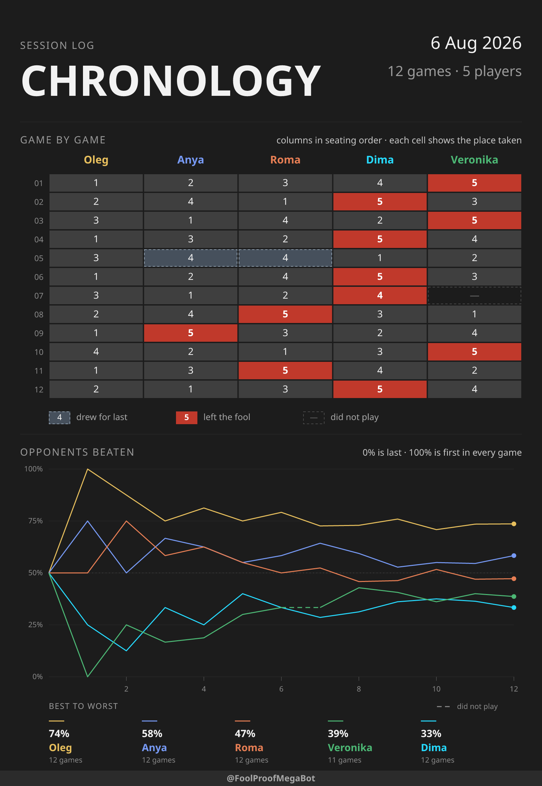
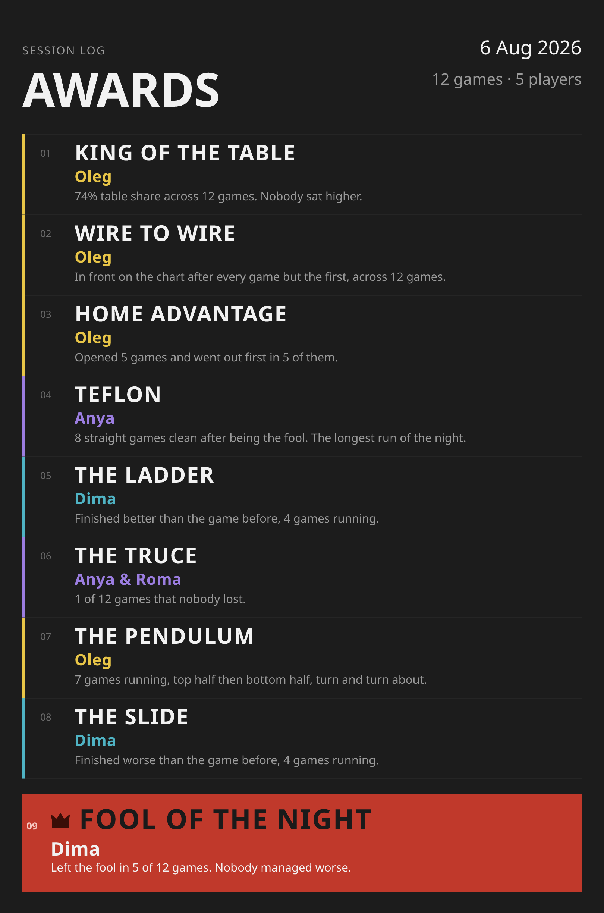
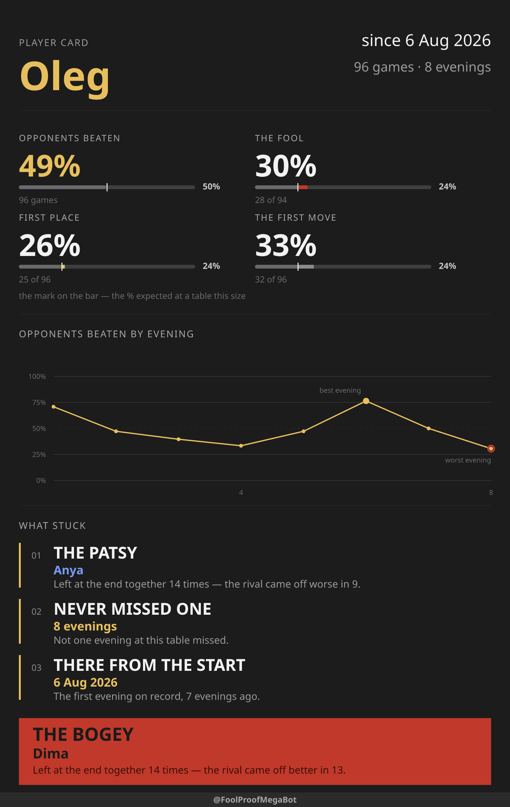

# FoolProof

A Telegram bot that keeps the score for a group of friends playing Podkidnoy Durak.
It records who went first, the order players went out, and who was left the fool,
then draws the evening back as posters.

**[The landing page](https://oleg-vasilyev.github.io/FoolProof/)** is where the
product is: the screens, all three posters, and the questions a player asks, in
English and Russian, with [the case study](#the-website) beside it. This file is the
technical half — how to run it, how it is laid out, and where everything else is
written down.

One thing has to be said here too, because it explains every decision below. Input
happens on a Friday night, on a phone, one-handed, between games, so the whole product
is a single message with an inline keyboard: you tap the names in the order people
finish, and tap Confirm. There is nothing to type after the line-up.

## Commands

| Command | What it does |
|---|---|
| `/game Oleg, Anya, Roma` | Opens a card. The list is the seating order, clockwise |
| `/game` | Same, but asks for the names — for when you tapped the command from the menu |
| `/next` | A new card with the same line-up; the fool's neighbour goes first |
| `/next_with Zhenya` | The same line-up plus these players; asks for the names if sent without any, then asks where everyone sits |
| `/next_without Oleg` | The same line-up minus these players; sent bare, it lists the table and you tap whoever is sitting out |
| `/stats` | How the current session is going: the chronology, then the awards |
| `/stats_chronology` | The chronology picture on its own |
| `/stats_awards` | The awards picture on its own; needs five games |
| `/personal` | One player's card for all time — pick a name, get the poster |
| `/merge` | Folds a name typed twice into the right one |
| `/language` | Picks the language this chat is played in — English or Russian |
| `/start` | What the bot is, and a button that puts it in a group |
| `/help` | What the commands do and how the card works |

This table is the one place the commands are listed; `PLAN.md` says what each one
has to do.

### When one player ends up under two names

Somebody types a name one way once and another way for the rest of the evening, and
`/stats` grows a player who played one game. `/merge` lists every name with the games
behind it, and the **first name tapped is the one that stays**. There is no undo, which
is what the Confirm button is for; two merges at once are refused with the reason, and
[PLAN.md](PLAN.md#merging-two-names-into-one) says why.

### The pictures it sends back

`/stats` answers with two PNGs: the chronology of the evening, then the awards.
Both are below at the size a phone gets them, and both were drawn by the bot's own
renderer over a sample evening rather than by hand — `node scripts/tools.ts posters`
redraws them whenever the drawing code changes.

| The chronology — a row per game, a column per player | The awards — at most nine, and the fool last |
|---|---|
| [](docs/posters/chronology-en.png) | [](docs/posters/awards-en.png) |

`/personal` answers with a third: one player's card for everything they have ever
played here. Pick a name from the keyboard it offers and it draws the numbers, the
share of the table evening by evening, what stuck, and who has been the worst news.
Twenty facts can stick and a card prints at most four, so two players at the same
table get two different cards.

| The player card — six numbers, a career chart, and whichever facts this player earned |
|---|
| [](docs/posters/personal-en.png) |

The grid prints the finishing position in every cell, and marks only what an
ordinary finish is not: drew for last, left the fool, did not play. Under it, each
player's running share of the table — 50% is mid-table, 100% is winning every game.
The awards need five games before there are any. Thirty-six of them exist and nine
fit, so the card keeps the king and the fool and fills the rest with
[the rarest of what the evening earned](PLAN.md#two-orders-and-why-there-have-to-be-two)
— which is what stops every Friday reading the same.

Every colour, size and rule behind the two is specified in the [poster design
system](https://claude.ai/design/p/dfdd20cb-3609-4baa-935d-eb20b8257c2c?file=Durak+Stats+Poster+System.dc.html),
which lives in Claude Design rather than here and opens only for somebody with
access to that project. It is not decoration: the two mockups on it are the same
SVG committed under `docs/posters/`, and `npm run check` fails when either stops
matching what the renderer draws. Two skills keep the three in step:
`refresh-the-pictures` redraws what the repository holds, and
`update-the-design-page` carries the result back to the page.

## Running it

Node 24 or newer. There is no build step — Node runs the TypeScript directly.

```bash
npm install
npm start
```

That prints an address. Open it and you are in a chat with the bot, against a
**fake Telegram** — no token, no network, nothing to configure. It runs the real
`src/main.ts`, so what answers you is the bot, not a mock of it.

**`npm run start:prod` is how the bot really starts**, and the systemd unit on the
server runs exactly that — so `package.json` describes production rather than
paraphrasing it. Do not run it here: the bot is [running on a
server](deploy/README.md#running-it-on-a-server), one token serves exactly one process, and
[PLAN.md](PLAN.md#edge-cases) says what a second one does to the updates. It needs
`.env.production`, which exists only on the server for the same reason.

The `.env` you keep locally is the *server's* configuration, sent there by
[`deploy/configure-server.sh`](deploy/configure-server.sh); nothing on this machine
runs from it.

The cost is that the bot only meets the real Bot API in production. If you need
to see a change in a real Telegram client first, get a second token from
[@BotFather](https://t.me/BotFather) and run the supervisor against it by hand —
that is one command, and [deploy/README.md](deploy/README.md#running-it-on-a-server) has the
shape of it.

The bot connects by long polling, so it needs no public address, no certificate
and no reverse proxy. It does need to actually be running when people play.

Add the bot to the group and leave BotFather's privacy mode at its default. In
that mode a bot sees only commands and replies to its own messages — which is
exactly what this one needs, and it never reads the rest of the conversation.

## Two databases, and only one of them is real

| Database | Who writes to it | Where it lives |
|---|---|---|
| `data/foolproof.dev.db` | `npm start`, and every e2e scenario | your machine, gitignored |
| whatever `DB_PATH` names | the bot on the server | the server, outside the clone |

`npm start` takes `--db=<path>` if you want to play against a copy of
something else. Nothing local can reach the real one: it is on the server, and the
`.env.production` naming it is on the server too.

Both are SQLite files. Back one up by copying the `.db` file **together with its
`-wal` and `-shm` sidecars**, or after stopping the bot — the write-ahead log can
hold games the main file does not have yet.

`/stats` draws a PNG, which needs the two font files in `assets/fonts/`. They are
committed, so a clone has them; the bot refuses to start without them, because a
missing font makes the renderer draw the picture with no text on it rather than
fail. Rasterizing uses `@resvg/resvg-js`, which ships a prebuilt binary per
platform — still no build step, but `npm install` now needs to be run on the
machine that will run the bot rather than copied from another one.

## Putting it on a server

The bot runs on a machine nobody is sitting at. Everything about getting it there and
keeping it there is [deploy/README.md](deploy/README.md) — the operator's half, long,
and needed by nobody who only wants to run the bot here or change the code.

## Scripts

They are listed in `package.json` in the order you reach for them: the one that
runs the bot, the gates, their parts, then the two test families.

| Script | What it runs |
|---|---|
| `npm run start:prod` | The bot for real, under the supervisor. **This is what the server runs** — [`deploy/foolproof.service`](deploy/foolproof.service) calls this line, so it cannot drift from it |
| `npm start` | The same bot in a browser against a fake Telegram — no token, no network, and the one to run here |
| `npm run check` | Lint, types, documents and tests — the everyday gate to keep at zero |
| `npm run check:push` | What a push to `main` must not break — lint, types (app and harness), the harness's own tests, documents; the website ships from `main`, the app's tests wait for the tag. **CI runs this on every push** |
| `npm run check:phase` | The phase gates in one command: lint, types, coverage, mutation over the diff, e2e over the diff — each test run exactly once. No `docs:check`: documents and pictures are finished after the review, in their own stages |
| `npm run check:release` | The full battery: `check:push`, then coverage, all mutants, every scenario. **CI runs this on every release tag** |
| `npm run lint` / `lint:fix` | ESLint, which enforces this project's conventions |
| `npm run typecheck` | `tsc --noEmit` |
| `npm run docs:check` | Links, anchors, the source tree, the script table above, and that every skill and agent is reachable from `CLAUDE.md` |
| `npm test` | Vitest, once — units and integration together |
| `npm run test:unit` | Only the unit specs, where everything outside the file is mocked |
| `npm run test:integration` | Only `*.integration.spec.ts` — the seams where third-party code runs for real |
| `npm run test:watch` | Vitest left running while you edit |
| `npm run test:coverage` | Vitest with coverage; fails below 70% on any metric |
| `npm run test:mutation:changed` | Stryker over the files that differ from `origin/main`, about a minute |
| `npm run test:mutation` | Stryker over everything, about five minutes; two runs, the bot at 85% and the tooling at 80% |
| `npm run e2e` | Whole scenarios against the real bot and a fake Telegram |
| `npm run e2e:changed` | Only the scenarios the diff against `origin/main` can reach |
| `npm run e2e:watch` | The same run, slowed down, in one browser tab |
| `npm run e2e:test` | Units for the harness's own pure parts |
| `npm run e2e:typecheck` | `tsc` over `e2e/`, which has its own config |
| `npm run prepare` | Run by `npm install` itself: points git at `.githooks/`, where the pre-push tag gate and the commit-msg flow gate live |

`start:prod` is the only one that reads an env file, and the only one that talks to
Telegram. Everything else runs against the fake one in `e2e/`.

Coverage and mutation write their reports into `reports/`, which is gitignored
whole — nothing about testing lands next to the source. Anything else that ends up
there is swept by `node scripts/tools.ts tidy-reports`.

Occasional jobs stay out of that table and live behind one script, which lists
itself and what each one is for when run with no argument:

```bash
node scripts/tools.ts
```

## Watching it play

`npm test` proves the pieces. `npm run e2e` proves the bot: it starts
`src/main.ts` as a real process against a real SQLite file, and puts a **fake
Telegram** on the other end of it — a small Bot API server that records the chat
instead of sending it anywhere. A scenario then plays a whole evening the way a
person would: type `/game Oleg, Anya, Roma`, tap the names, tap Confirm, ask for
`/stats`. No token, no network, no rate limits.

```bash
npm run e2e
```

Every scenario gets its own bot process, its own database and its own port, so
they run at the same time — one per worker.

```bash
npm run e2e:watch
```

The same run with a pause after every action, and **one browser tab** —
<http://127.0.0.1:8080>. Down the left is **every scenario by name**, marked as it
passes, fails or runs; the middle holds every world side by side as a live frame.
Picking a scenario from the list fills the page with that one chat and nothing else,
which is the way to answer "what is this group of tests actually doing". Each frame
is the chat: the messages as Telegram would show them, the inline keyboard, the
callback answers as toasts, the `/stats` picture, and a divider between scenarios so
nothing scrolls away.

It is one tab rather than one per world because **a tab opened by the operating
system cannot be closed again by the process that opened it** — five of them
outlived every run and had to be dismissed by hand.

**The chats stay readable after the run ends.** The hub keeps the last state of
every world and the pictures it drew, so the page still has everything when the
scenarios have finished and their bots are gone; it says so in the header rather
than looking broken. Ctrl+C in the terminal ends it.

```bash
npm start
```

One chat, nobody driving it, pointed at the dev database. Type in the box and tap
the buttons — it is the same fake Telegram, so the bot cannot tell the difference.
Add `--db=data/somewhere.db` to keep an experiment out of the dev database.

The harness is deliberately walled off from the app, and it is **a release gate**:
`npm run e2e:changed` plays the scenarios a diff can reach.
[`e2e/README.md`](e2e/README.md) has its rules, `TECH-DEBT.md` has the one thing
still wrong with it.

## The website

Telegram has no bot store, so nothing outside it can find the bot on its own.
[oleg-vasilyev.github.io/FoolProof](https://oleg-vasilyev.github.io/FoolProof/) is
the address a directory listing, a forum post or a search result can point at. It is
static pages — a landing and a case study, each in English and in Russian under
`/ru/` — served by GitHub Pages straight out of `docs/` on `main`, so a push is the
whole deploy: no workflow, no second branch, nothing to keep in step by hand.

**[The case study](https://oleg-vasilyev.github.io/FoolProof/case-study/)** is the
other thing the site says: how the harness around this bot — `CLAUDE.md`, the
skills, the agents, the hooks, the lint rules and `docs:check` — was built, broken
and rebuilt over the 274 commits between 28 July and 2 September 2026, told in six
eras, with a strip of every commit and charts read from the tree at each one. It was
written from the git history alone. Both languages share
`docs/case-study/commit-history-charts.js`, which carries the per-commit numbers and draws
them; they are a snapshot of the history at commit 274, dated on the page, and
nothing regenerates them.

Two parts of it are generated rather than written:

| What | Rebuilt by |
|---|---|
| `docs/posters/` — every poster in both languages: SVG, the WebP the pages show at the width they are read at, and a PNG of the English three at the width the bot sends | `node scripts/tools.ts posters` |
| `docs/styles.computed.css` — Tailwind, minified and committed | `node scripts/tools.ts site-css` |

**`npm run docs:check` fails on either being stale**, and that is the point: a push
is the deploy, so a forgotten rebuild does not wait to be noticed — it ships. The
posters are the bot's own renders of one sample evening — English copy with Latin
names for one page, Russian for the other, and the English three are the very files
shown at the top of this README — compared against what the renderer draws today. The stylesheet is checked the way its
failure actually arrives: every class either page uses has to have a rule in it, so
adding one and forgetting the rebuild is a red gate rather than an unstyled element
in production.

The two stylesheets sit together in `docs/` and their names say which is which:
`styles.source.css` is written by hand, `styles.computed.css` is what the compiler
makes of it and what both pages link. Keeping the source beside its output costs one
file served that nothing links to, and buys a reader finding both in the folder whose
styles they are. The **compiler** is not a dependency of this
project — `site-css` fetches the CLI with `npx`, because it brings native binaries and
a wasm fallback that once made `npm ci` refuse the lock file, and the server would
install all of it on every deploy to build a stylesheet it has no idea exists. The
**framework** is one, and has to be: the CLI resolves `@import "tailwindcss"` from the
folder the input sits in, so on a clean clone it finds nothing and the build fails
outright. That is 821 KB of CSS and JavaScript with no dependencies of its own and
nothing to compile — the cheap half of the pair, and the half without which the tool
does not run at all. Building the CSS rather than letting a script tag do it in the
visitor's browser is what keeps the first screen at 44 KB with the posters below it
lazy.

A page nobody links to is read by nobody, so two questions are worth asking of it:
does anyone arrive, and does arriving lead anywhere. Each has its own dashboard, and
neither can answer the other's question:

| Dashboard | What only it knows |
|---|---|
| [GoatCounter](https://alehvasilyeu.goatcounter.com/) | how many people opened a page and where they came from — plus a click event on every `t.me` link, named `add-to-group-<lang>` or `open-bot-<lang>`, so the button and the language both show |
| [Search Console](https://search.google.com/search-console) | how often Google *offered* the pages to somebody who then did not click. An impression never reaches the page, so no script on it can count one |

Both are read-only errands for whoever runs the bot; the sign-in is personal, and
the links are here so the next person does not have to rediscover which two tabs to
open. The beacon sets no cookie and stores nothing personal, which is why the pages
carry no consent banner, and a visitor who blocks it costs one uncounted visit
rather than a broken page. The Search Console `<meta>` tag verifies the URL-prefix
property ending in `/FoolProof/`, because the domain above it is GitHub's.

## How a change becomes a release

The bot is developed by an AI agent — Claude Code, driven by the skills in
[`.claude/skills/`](.claude/skills/). The whole loop, from the owner's first
message to the tag going live on the server, is drawn as one sequence diagram
in [DEVELOPMENT-FLOW.md](DEVELOPMENT-FLOW.md) — GitHub renders it in place.
The drawing is the map, not the authority: each stage's rules live in the
skill it names, and the retrospective stage redraws any step a lesson changes.

## Layout

A feature is a folder you can delete: nothing outside it imports it except the
composition root, which names the roster.

```
src/
  supervisor.ts         runs main.ts and starts it again if it dies
  main.ts               names the features and wires them; starts polling
  feature-installer.ts  registers whatever features it was given
  features/
    live-game/          playing a game on a live card of buttons
    merge-names/        the /merge screen
    scoresheet/         the pictures /stats and /personal send back
    diagnostics/        the /status report about the bot itself
    language/           the /language screen that picks the chat's language
  shared/               config/, drawing/, drawings/, fonts/, lifecycle/, locale/,
                        logging/, repository/, table/, telegram/, text/, timing/ —
                        a folder per subject
assets/fonts/           the two faces the scoresheet is drawn with
docs/                   the website GitHub Pages serves — everything in here is public
docs/posters/           the posters this file shows, drawn by scripts/tools.ts,
                        served along with the site because they live inside it
deploy/                 the systemd units a server is installed from, the scripts
                        that put the newest tag live and send the server its
                        configuration, and the runbook for all of it
.github/workflows/      the checks that run on every push
scripts/                dev utilities that are not part of the bot; docs-check/
                        holds what `docs:check` asks — `documents/` what is read
                        out of the documents, `source/` what they are held against
e2e/                    the fake Telegram and the scenarios played against it
logbook/                no code — a dated log per phase and a report per checkup,
                        kept so that a habit spanning several of them is visible
```

Inside every feature the same layers — `domain/` pure, `render/` pure, `samples/`
the states worth drawing at, `bot/` the impure edge — with imports pointing only
downward, and specs and stubs sitting next to the file they stand for. ESLint
enforces it: a cross-feature import, a framework import in `domain/`, and a script
that names a feature are all build errors.
[CLAUDE.md](CLAUDE.md#layers-live-inside-a-feature) has the rest.

## The other documents

- **[deploy/README.md](deploy/README.md)** — putting the bot on a server and keeping
  it there. Not needed to run it here or to change the code.
- **[PLAN.md](PLAN.md)** — what the bot does and why: the state machine, the data
  model, the invariants, the edge cases, and the design dead ends already paid for.
  Read it before changing behaviour.
- **[CLAUDE.md](CLAUDE.md)** — how the code here is written: style, layering,
  testing, and the gates a phase has to pass. Read it before writing code.
- **[TECH-DEBT.md](TECH-DEBT.md)** — what is deliberately unfinished, and the
  trigger that would make each item worth picking up.

`CLAUDE.md` opens with the question that decides which file a fact goes in.

## Licence

MIT — [`LICENSE`](LICENSE). Run your own copy, change it, or take a piece of it;
the only condition is that the notice travels with it.
